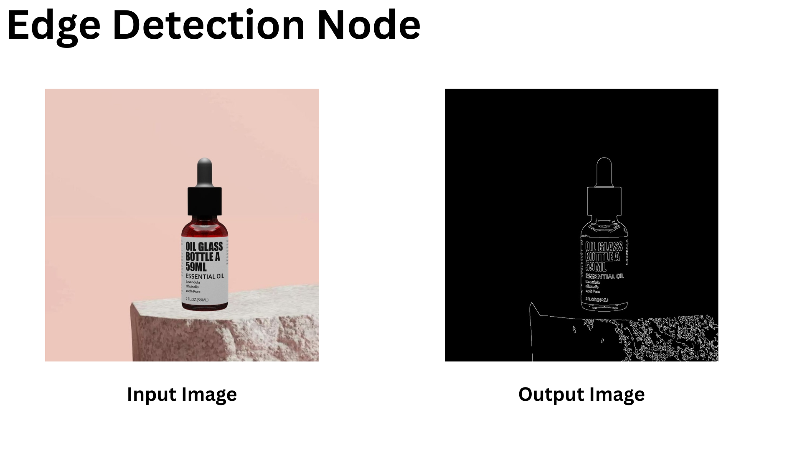
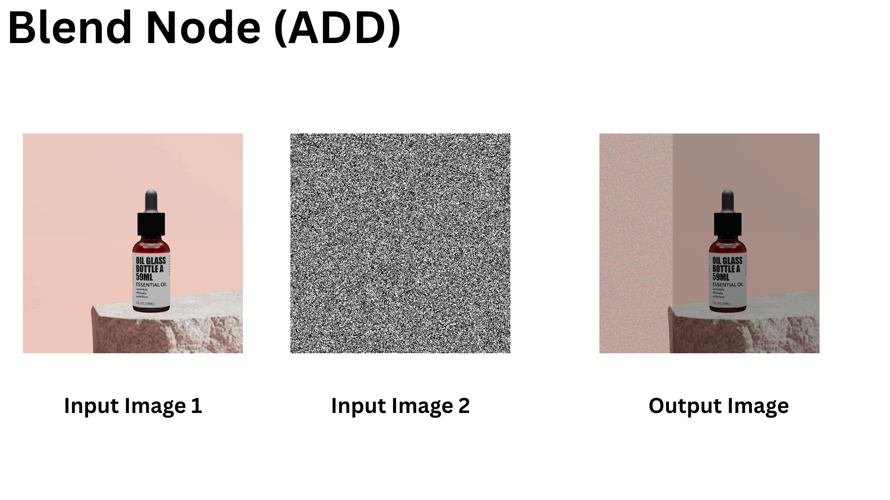
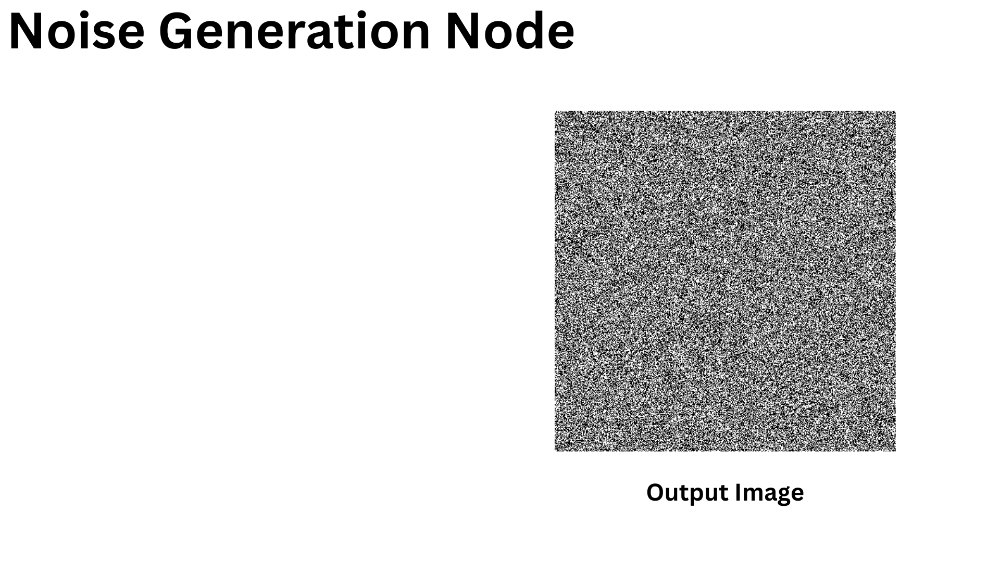
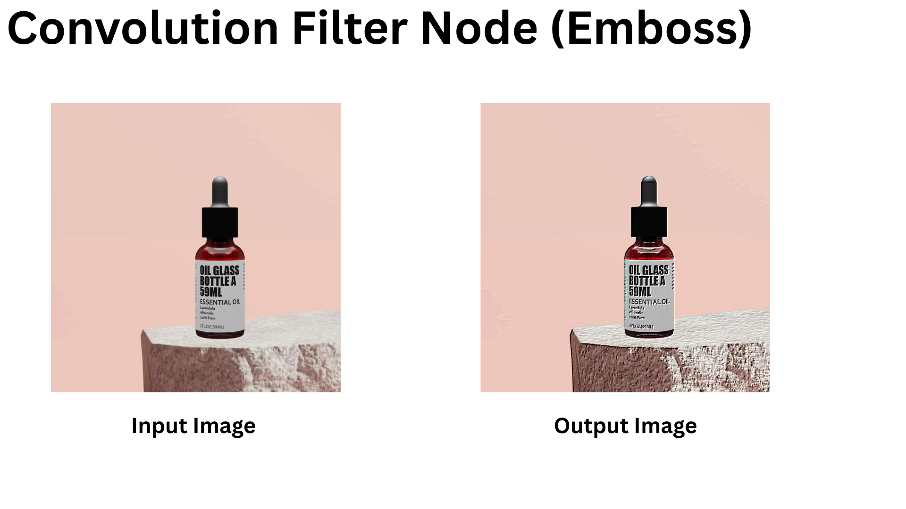

# node-based-image-processor

## Installation Steps

1.  Download and Extract OpenCV

    - Download OpenCV 4.11.0 from the official OpenCV website

    - Extract the downloaded archive to C:/opencv

2.  Configure Environment Variables
    Add the OpenCV bin directory to your system's PATH environment variable:

    - Right-click on "My Computer" or "This PC" and select "Properties"

    - Click on "Advanced system settings"

    - Click on "Environment Variables"

    - Under "System variables", find and select "Path", then click "Edit"

    - Add the path to the OpenCV bin directory (e.g., C:\opencv\build\x64\vc16\bin)

    - Click "OK" to save changes

3.  Create a New Visual Studio Project
    Open Visual Studio

    - Create a new empty C++ project

    - Ensure the platform is set to x64 (not Win32)

4.  Configure Project Properties
    For All Configurations (Debug and Release):

    1. C++/General → Additional Include Directories:

       - Add C:\opencv\build\include

    2. Linker/General → Additional Library Directories:

       - Add C:\opencv\build\x64\vc16\lib (adjust according to your Visual Studio version)

    3. Linker/Input → Additional Dependencies:

       - For Debug configuration: opencv_world4110d.lib

       - For Release configuration: opencv_world4110.lib

    4. Debugging → Environment:

       - Add PATH=C:\opencv\build\x64\vc16\bin;%PATH%

## Building and Running

- Select the appropriate configuration (Debug or Release) and platform (x64)

- Build the solution (F7 or Build → Build Solution)

- Run the program (F5 or Debug → Start Debugging)

## Brightness/Contrast Node

1. Adjust image brightness with a slider (-100 to +100)
2. Adjust image contrast with a slider (0 to 3)
3. Provide reset buttons for each parameter

```c++
// Brightness and contrast OpenCV Function
// Formula: output = alpha * input + beta
inputImage.convertTo(outputImage, -1, m_alpha, m_beta);
```

```c++
BrightnessContrastNode("Brightness/Contrast", 1.2f, 10.0f);
```


## Color Channel Splitter

1. Split RGB/RGBA image into separate channel outputs
2. Option to output grayscale representation of each channel

```C++
std::vector<cv::Mat> channels;
cv::split(inputImage, channels);
m_channelCount = channels.size();

// Creating 3-channel outputs for color visualization
for (int i = 0; i < m_channelCount; ++i) {
    std::vector<cv::Mat> outputChannels;

    if (m_channelCount == 3) {
        outputChannels = {
            (i == 0) ? channels[i] : cv::Mat::zeros(inputImage.size(), CV_8UC1),  // Blue
            (i == 1) ? channels[i] : cv::Mat::zeros(inputImage.size(), CV_8UC1),  // Green
            (i == 2) ? channels[i] : cv::Mat::zeros(inputImage.size(), CV_8UC1)   // Red
        };
    }
    else {
        // For other channel counts, show single channel in first position
        outputChannels.resize(3, cv::Mat::zeros(inputImage.size(), CV_8UC1));
        outputChannels[0] = channels[i];
    }

    cv::Mat colorOutput;
    cv::merge(outputChannels, colorOutput);
    m_outputValues[i] = colorOutput;
}
```


## Blur Node

1. Implement Gaussian blur with configurable radius (1-20px)
2. Option for uniform or directional blur
3. Include preview of kernel for educational purposes

```C++
cv::Mat outputImage;

// Applying the selected blur effect
switch (m_blurType) {
    case BlurType::BOX:
        cv::blur(inputImage, outputImage, cv::Size(m_kernelSize, m_kernelSize));
        break;

    case BlurType::GAUSSIAN:
        cv::GaussianBlur(inputImage, outputImage, cv::Size(m_kernelSize, m_kernelSize), m_sigmaX, m_sigmaY);
        break;

    case BlurType::MEDIAN:
        cv::medianBlur(inputImage, outputImage, m_kernelSize);
        break;

    case BlurType::BILATERAL:
        cv::bilateralFilter(inputImage, outputImage, m_kernelSize, m_sigmaColor, m_sigmaSpace);
        break;

    default:
        std::cerr << "BlurNode::process: Unknown blur type." << std::endl;
        outputImage = inputImage.clone();
        break;
    }

m_outputValues[0] = outputImage;
```

```c++
BlurNode* blurNode = new BlurNode("Blur", BlurType::GAUSSIAN, 15);
```


## Threshold Node

1. Convert to binary image based on threshold value
2. Include options for different thresholding methods (binary, adaptive, Otsu)
3. Display histogram of image to assist with threshold selection

```c++
switch (m_thresholdType) {
    case ThresholdType::BINARY:
        cv::threshold(grayImage, outputImage, m_threshold, m_maxValue, cv::THRESH_BINARY);
        break;

    case ThresholdType::BINARY_INV:
        cv::threshold(grayImage, outputImage, m_threshold, m_maxValue, cv::THRESH_BINARY_INV);
        break;

    case ThresholdType::TRUNC:
        cv::threshold(grayImage, outputImage, m_threshold, m_maxValue, cv::THRESH_TRUNC);
        break;

    case ThresholdType::TOZERO:
        cv::threshold(grayImage, outputImage, m_threshold, m_maxValue, cv::THRESH_TOZERO);
        break;

    case ThresholdType::TOZERO_INV:
        cv::threshold(grayImage, outputImage, m_threshold, m_maxValue, cv::THRESH_TOZERO_INV);
        break;

    case ThresholdType::OTSU:
        cv::threshold(grayImage, outputImage, m_threshold, m_maxValue, cv::THRESH_BINARY | cv::THRESH_OTSU);
        break;

    case ThresholdType::ADAPTIVE_MEAN:
        cv::adaptiveThreshold(grayImage, outputImage, m_maxValue, cv::ADAPTIVE_THRESH_MEAN_C,
            cv::THRESH_BINARY, m_blockSize, m_C);
        break;

    case ThresholdType::ADAPTIVE_GAUSSIAN:
        cv::adaptiveThreshold(grayImage, outputImage, m_maxValue, cv::ADAPTIVE_THRESH_GAUSSIAN_C,
            cv::THRESH_BINARY, m_blockSize, m_C);
        break;

    default:
        std::cerr << "ThresholdNode::process: Unknown threshold type." << std::endl;
        outputImage = grayImage.clone();
        break;
    }

m_outputValues[0] = outputImage;
```

```c++
ThresholdNode* thresholdNode = new ThresholdNode("Threshold", ThresholdType::ADAPTIVE_GAUSSIAN);
```


## Edge Detection Node

1. Implement both Sobel and Canny edge detection algorithms
2. Allow configuration of parameters (thresholds, kernel size)
3. Option to overlay edges on original image

```c++
cv::Mat outputImage;
cv::Mat grayImage;

// Convert to grayscale if the image has multiple channels
if (inputImage.channels() > 1) {
    cv::cvtColor(inputImage, grayImage, cv::COLOR_BGR2GRAY);
}
else {
    grayImage = inputImage.clone();
}

// Applying the selected edge detection method
switch (m_edgeType) {
case EdgeDetectionType::SOBEL: {
    cv::Mat gradX, gradY;
    cv::Sobel(grayImage, gradX, CV_16S, 1, 0, m_apertureSize);
    cv::Sobel(grayImage, gradY, CV_16S, 0, 1, m_apertureSize);
    cv::convertScaleAbs(gradX, gradX);
    cv::convertScaleAbs(gradY, gradY);
    cv::addWeighted(gradX, 0.5, gradY, 0.5, 0, outputImage);
    break;
}

case EdgeDetectionType::SCHARR: {
    cv::Mat gradX, gradY;
    cv::Scharr(grayImage, gradX, CV_16S, 1, 0);
    cv::Scharr(grayImage, gradY, CV_16S, 0, 1);
    cv::convertScaleAbs(gradX, gradX);
    cv::convertScaleAbs(gradY, gradY);
    cv::addWeighted(gradX, 0.5, gradY, 0.5, 0, outputImage);
    break;
}

case EdgeDetectionType::LAPLACIAN:
    cv::Laplacian(grayImage, outputImage, CV_16S, m_apertureSize);
    cv::convertScaleAbs(outputImage, outputImage);
    break;

case EdgeDetectionType::CANNY:
    cv::Canny(grayImage, outputImage, m_threshold1, m_threshold2, m_apertureSize, m_L2gradient);
    break;

default:
    std::cerr << "EdgeDetectionNode::process: Unknown edge detection type." << std::endl;
    outputImage = grayImage.clone();
    break;
}

m_outputValues[0] = outputImage;
```

```c++
EdgeDetectionNode* edgeNode = new EdgeDetectionNode("Edge Detection", EdgeDetectionType::CANNY, 50, 150);
```



## Blend Node

1. Combine two images using different blend modes
2. Support at least 5 blend modes (normal, multiply, screen, overlay, difference)
3. Include opacity/mix slider

```c++
    void BlendNode::process() {
    if (!isReady()) {
        std::cerr << "BlendNode::process: Node is not ready to process." << std::endl;
        return;
    }

    auto input1 = getInputConnection(0);
    auto input2 = getInputConnection(1);

    if (!input1.first || !input2.first) {
        std::cerr << "BlendNode::process: Missing input connections." << std::endl;
        return;
    }

    cv::Mat inputImage1 = input1.first->getOutputValue(input1.second);
    cv::Mat inputImage2 = input2.first->getOutputValue(input2.second);

    if (inputImage1.empty() || inputImage2.empty()) {
        std::cerr << "BlendNode::process: One or both input images are empty." << std::endl;
        return;
    }

    // Ensure both images have the same size and type
    if (inputImage1.size() != inputImage2.size()) {
        // Resize the second image to match the first
        std::cout << "Images not of same size" << std::endl;
        cv::resize(inputImage2, inputImage2, inputImage1.size());
    }

    // Ensure same number of channels
    if (inputImage1.channels() != inputImage2.channels()) {
        if (inputImage2.channels() == 1) {
            cv::cvtColor(inputImage2, inputImage2, cv::COLOR_GRAY2BGR);
        }
        else {
            cv::cvtColor(inputImage2, inputImage2, cv::COLOR_BGR2GRAY);
        }
    }

    // Convert images to the same type if needed
    int targetType = inputImage1.type();
    if (inputImage2.type() != targetType) {
        inputImage2.convertTo(inputImage2, targetType);
    }

    cv::Mat outputImage;

    // Apply the selected blending mode
    switch (m_blendMode) {
    case BlendMode::NORMAL:
        applyNormalBlend(inputImage1, inputImage2, outputImage);
        break;

    case BlendMode::ADD:
        applyAddBlend(inputImage1, inputImage2, outputImage);
        break;

    case BlendMode::MULTIPLY:
        applyMultiplyBlend(inputImage1, inputImage2, outputImage);
        break;

    case BlendMode::SCREEN:
        applyScreenBlend(inputImage1, inputImage2, outputImage);
        break;

    case BlendMode::OVERLAY:
        applyOverlayBlend(inputImage1, inputImage2, outputImage);
        break;

    case BlendMode::DARKEN:
        applyDarkenBlend(inputImage1, inputImage2, outputImage);
        break;

    case BlendMode::LIGHTEN:
        applyLightenBlend(inputImage1, inputImage2, outputImage);
        break;

    case BlendMode::DIFFERENCE:
        applyDifferenceBlend(inputImage1, inputImage2, outputImage);
        break;

    default:
        std::cerr << "BlendNode::process: Unknown blend mode." << std::endl;
        applyNormalBlend(inputImage1, inputImage2, outputImage);
        break;
    }

    cv::addWeighted(inputImage1, 1.0 - m_alpha, inputImage2, m_alpha, 0.0, outputImage);

    m_outputValues[0] = outputImage;
}
```

```c++
BlendNode* blendNode = new BlendNode("Blend", BlendMode::ADD, 0.3f);
```



## Noise Generation Node

1. Create procedural noise patterns (Perlin, Simplex, Worley)
2. Allow configuration of noise parameters (scale, octaves, persistence)
3. Option to use noise as displacement map or direct color output

```c++
void NoiseGenerationNode::process() {
    if (m_width <= 0 || m_height <= 0) {
        std::cerr << "NoiseGenerationNode: Invalid dimensions" << std::endl;
        return;
    }
    cv::Mat noiseImage(m_height, m_width, CV_8UC3);

    switch (m_noiseType) {
        case NoiseType::GAUSSIAN:
            generateGaussianNoise(noiseImage);
            break;
        case NoiseType::UNIFORM:
            generateUniformNoise(noiseImage);
            break;
        case NoiseType::SALT_PEPPER:
            generateSaltPepperNoise(noiseImage);
            break;
        default:
            std::cerr << "NoiseGenerationNode::process: Unknown noise type." << std::endl;
            noiseImage = cv::Mat::zeros(m_height, m_width, CV_8UC3);
            break;
    }

    m_outputValues[0] = noiseImage;

}
```

```c++
NoiseGenerationNode* noiseNode = new NoiseGenerationNode("Noise", NoiseType::GAUSSIAN, 512, 512, 0.0f, 25.0f);
```



## Convolution Filter Node

1. Provide a 3x3 or 5x5 matrix for custom kernel definition
2. Include presets for common filters (sharpen, emboss, edge enhance)
3. Display visual feedback of the kernel effect

```c++
    void ConvolutionFilterNode::process() {
        if (!isReady()) {
            std::cerr << "ConvolutionFilterNode::process: Node is not ready to process." << std::endl;
            return;
        }

        auto inputConnection = getInputConnection(0);
        if (inputConnection.first == nullptr) {
            std::cerr << "ConvolutionFilterNode::process: No valid input connection." << std::endl;
            return;
        }

        cv::Mat inputImage = inputConnection.first->getOutputValue(inputConnection.second);
        if (inputImage.empty()) {
            std::cerr << "ConvolutionFilterNode::process: Received empty image from input." << std::endl;
            return;
        }

        cv::Mat outputImage;

        // Apply the convolution filter
        if (m_kernel.empty()) {
            std::cerr << "ConvolutionFilterNode::process: Kernel is empty." << std::endl;
            outputImage = inputImage.clone();
        }
        else {
            // Process each channel separately for multi-channel images
            if (inputImage.channels() > 1) {
                std::vector<cv::Mat> channels;
                cv::split(inputImage, channels);

                std::vector<cv::Mat> filteredChannels;
                for (const auto& channel : channels) {
                    cv::Mat filteredChannel;
                    cv::filter2D(channel, filteredChannel, -1, m_kernel, cv::Point(-1, -1), 0, m_borderType);
                    filteredChannels.push_back(filteredChannel);
                }

                cv::merge(filteredChannels, outputImage);
            }
            else {
                // Single channel image
                cv::filter2D(inputImage, outputImage, -1, m_kernel, cv::Point(-1, -1), 0, m_borderType);
            }
        }

        m_outputValues[0] = outputImage;
    }
```

```c++
ConvolutionFilterNode* embossFilter = new ConvolutionFilterNode("Emboss Filter", ConvolutionFilterType::EMBOSS);
```


